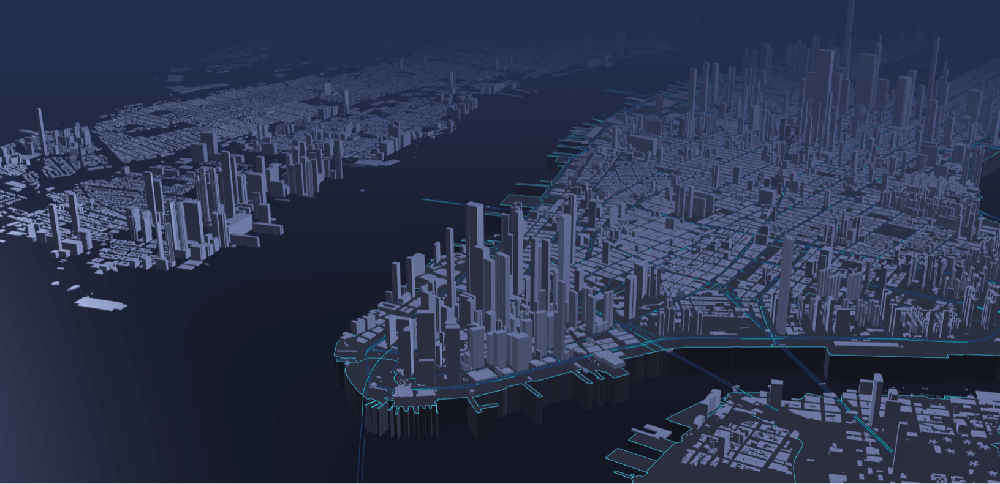

<!-- _coverpage.md -->

    

# CUBE.gl <small>Alpha 1.0</small>

> Data-Driven Geospatial Data Visualization Framework
    

[GitHub](https://github.com/isjeffcom/CUBE.gl)
[Examples](https://isjeffcom.github.io/CUBE.gl-examples/)
[Showcase](https://isjeffcom.github.io/CUBE.gl-examples/)
[Get Started](#introduction)

<!-- background color -->

