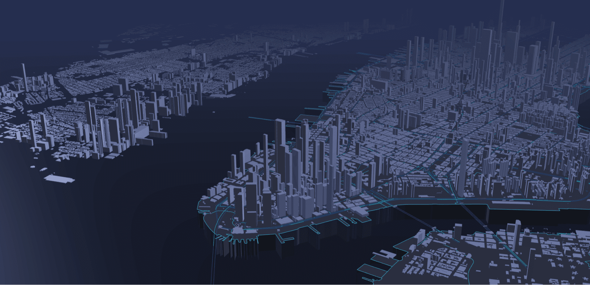

<!-- _coverpage.md -->

    

# CUBE.gl <small>Alpha 1.0</small>

> WebGL-powered Geographic-Based Data Visualization Framework

- Visualise GeoData
- Animation Objects
- In A Few Line of Code

[GitHub](https://github.com/docsifyjs/docsify/)
[Examples](#introduction)
[Showcase](#introduction)
[Get Started](#introduction)

<!-- background color -->

