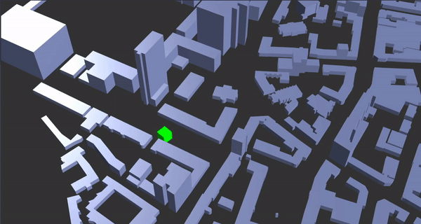

# Developer Guide


## Overview

The CUBE.gl package a range of functions for rapid prototyping. This library is in publish for **testing** and in **active development**.  


*It is important for you to know that the CUBE.gl is based on the brilliant **three.js** by **mrdoob**. You can use most of the three.js functions and methods in CUBE. To understand how to use threejs with CUBE.gl, check [here](/docs/use#use-with-threejs)*


## Initialize Space

All the development process started from construct a CUBE.Space(). A CUBE.Space() created by cloning a default config file. You can pass in an object to overwrite the default config. 


```javascript
// Init CUBE instance
const C = new CUBE.Space(container, {
	background: "333333", // Set Background Color
	center: {latitude: 34.710554, longitude: 103.699520}, // Set a geo location center
	scale: .002, // Set a map scale
	camera:{
		position: {x: 5, y: 5, z: 5} // Set camera default position
	}
})
```


You must define your central location, and it will be as a base reference for all coordinate calculation.


`{center: {latitude: Number, longitude: Number}}`


Consider the scale carefully. As for most of the case, you will set up a scale in a range between 1-15 to visualize things in the city level. For display a map as big (geographically) as a country like the US or China, the number could range between 0.001 - 0.01.


**List of available configuration check [here](docs/apis/spaceconfig)**


## Object and Layer


### Add object or layer

You can add an object to the whole scene (CUBE.Space) by

```javascript
let C = new CUBE.Space()
C.Add(Object3D)
```


The 'Object3D' is a 3D object, it must be created by CUBE, or a Object3D object in three.js.


You can also add an Layer to the main scene to group an array of objects.

```javascript
let C = new CUBE.Space()
let things = new CUBE.Layer() // Create a new layer
things.Add(object) // Add an object to this new layer
C.Add(things.layer) // Add this layer to CUBE.Space
```


In CUBE.gl, all objects from Layer classes (eg. GeoLayer) and Datasets class will return an Layer.layer object. You can add to CUBE.Space or any other layer directly. 

All objects from Data class is a single Object3D, you can add to CUBE.Space or any other layer directly.


### Delete and clear layer

You can call Layer.Delete(object3D) or CUBE.Space.Delete() to remove and object from a layer or CUBE.Space.

```javascript
let C = new CUBE.Space()
C.Add(object)
C.Delete(object)
```


You can call Layer.Clear() or CUBE.Space.Clear() to clear all object in a layer or CUBE.Space.

```javascript
let group = new CUBE.Layer()
group.Add(object1)
group.Add(object2)
group.Add(object3)
group.Clear()
```


### Find object in layer

You can call Layer.Find() or CUBE.Space.Find() to find an object in an Layer or CUBE.Space. The return object will be an three.js object3D 


## Object positioning

Position in CUBE.gl based on `CUBE.Coordinate` class. The `CUBE.Coordinate` contain 2 type of coordinates: 'GPS' and 'World'.

- GPS: {latitude, longitude, altitude} WGS84 EPSG4326 (used in GPS) coordinate, altitude is optional
- World: {x,y,z} 3d world coordinate. The center is 0,0,0.


At current version, the altitude can not been converted by a real altitude value, it will directly passed to world.y value. 


If you want to position an object by wgs84 coordinate (with latitude and longitude), you can do:

```javascript
// Compute wgs84 coordinate to 3d world coordinate
let posi = CUBE.Coordinate("GPS", {latitude: Number, longitude: Number}).ComputeWorldCoordinate()

// Create a shape and set up position by param
let mesh = CUBE.Shape("mesh", posi.world).Box()
// or
let mesh = CUBE.Shape().Box()
mesh.position = posi.world
```


Remember, you have to call ComputeWorldCoordinate() to get the world value, otherwise it would exist.


If you want to positioning by 3d world coordinate, just do this:

```javascript
let posi = CUBE.Coordinate("World", {x: Number, y: Number, z: Number})
// or
let posi = {x: 0, y: 0, z: 0}
```


You can also use Object3D.position to adjust any object, for example

```javascript
let obj = C.Add(new CUBE.Shapes("Sphere", {x: 0, y: 0, z: 0}).Sphere(1, 0x00ffff))
obj.position.set(2,2,2)
// or
obj.position.x = 2
obj.position.y = 2
obj.position.z = 2
```


## GeoLayer

City is about ground, buildings, road and water. To visualize a city, you will need CUBE.GeoLayer() class which is able to read .geojson format data and parse it to 3D model.


To create a `new CUBE.GeoLayer(name, data)` you will need to pass in at least 2 parameters: name for data name, data contain .geojson data object. 


**Parameters**

```javascript
@param {String} name: name of the layer
@param {Object} geojson: geojson data json object 
```


### Administrative

To render a Administrative map as ground `new CUBE.GeoLayer(name, geojson).AdministrativeMap(options, mat_map, mat_line)`

```javascript
let china = await (await fetch('./assets/geo/china.geojson')).json()
let amap = new CUBE.GeoLayer("china", china).AdministrativeMap({border: true, height: .5})
```


**Parameters**

```javascript
@param {Object} options {merge: Boolean, border: Boolean, collider: Boolean, height: Number} 
@param {THREE.Material} mat_line replace line material
@param {THREE.Material} mat_map replace map main material

options.merge: if use merge function to optimise performance
options.border: if enable highlight border
options.collider: if load invisible collider when merge is true
hoptions.height: height value
```


### Buildings

To render building very easy to use,  just like `new CUBE.GeoLayer(name, geojson).Buildings({merge: true, color: 0xE5E5E5}) `

```javascript
const nyc_building = await (await fetch('<url>/buildings.geojson')).json()
const buildings = new CUBE.GeoLayer("name", nyc_building).Buildings({merge: true, color: 0xE5E5E5})
```

*All color, inherited from three.js, is Hexadecimal triplet value which is a ordinary HEX value (6 digit or character you can find in Photoshop/Sketch/Figma) start with a '0x'.*


**Parameters**

```javascript
@param {Object} options {merge: Boolean, color: 0xffffff, collider: Boolean, terrain: CUBE.Terrain()} 
@param {THREE.Material} mat replace building material

options.merge: {Boolean} if use merge to optimise performance
options.color: {Number} color
options.collider: {Boolean} if load invisible collider when merge is true
options.terrain: {CUBE.Terrain || THREE.Object3D} CUBE.Terrain() object

```


Don't forget to use **merge: true** option to optimize the performance, it really has a huge impact on frame rate.


### Road

To render roads,  do ` new CUBE.GeoLayer(name, geojson).Road(options, material)`

```javascript
let nyc_road = await (await fetch('<url>/road.geojson')).json()
let roads = new CUBE.GeoLayer("name", nyc_road).Road()
```

You don't need to use merge to optimize road as it will be merged by default. If you wish not to merge (usually when if you need interaction or create animation), use RoadSp() instead.


**Parameters**

```javascript
@param {Object} options {color: 0xffffff} 
@param {THREE.Material} mat replace building material

options.color: {Number} color
```


### RoadSp

A special type of road. Road render by this method will have significant lower performance compare to Road(). But it can attach a built-in visual effect animation. Call ` new CUBE.GeoLayer(name, geojson).RoadSp(options, material)`

```javascript
// C -> CUBE.Space
// Init Animation Engine
const aniEngine = new CUBE.AnimationEngine(C)
C.SetAniEngine(aniEngine)

// Download road data
let roadData = await (await fetch('./assets/geo/project/highway.geojson')).json()

// Create RoadSp
let roads = new CUBE.GeoLayer("roadsp", roadData).RoadSp({animation: true, animationEngine: aniEngine, terrain: terrain})
C.Add(roads)
```


**Parameters**

```javascript
@param {Object} options {color: 0xffffff} 
@param {THREE.Material} mat replace building material

options.color: {Number} color color
options.animation: {Boolean} if enable animation
options.animationEngine: {CUBE.AnimationEngine} pass in animations engine pointer
```


### GeoPolygon

To visualize any polygon data from an .geojson file by `new CUBE.GeoLayer(name, geojson).Polygon({merge: Boolean})`

You can draw you own custom json from [geoman.io](https://geoman.io/geojson-editor)


```javascript
let island = await (await fetch('./assets/geo/cubemark.json')).json()
new CUBE.GeoLayer("island", island).Polygon({merge: true})
```


**Parameters**

```javascript
@param {Object} options: {color: 0xffffff, height: Number, merge: Boolean} 
@param {THREE.Material} mat: replacement material

options.color: color 
options.height: polygon height
options.merge: if use merge function to optimise performance
```


### Geojson requirement

To render Buildings and Roads, you will need this property in your .geojson file with:


Building:

```javascript
features[i].properties.building || features[i].properties.tags.building
```


Road:

```javascript
features[i].properties.highway || features[i].properties.tags.highway
```


OK. In one line of code (without http request), you are able to create a whole city, in your browser.  You can also choose to set a color or even replace material and for more options: see [here](/apis/GeoLayer).


*The Water is unfinished yet, I will not introduce it in this stage but you can find it in source code GeoLayer() class.*


### How to get geojson

To export .geojson format, one of the most popular choice is to use Overpass API. You can export an .geojson format buildings and roads from this easy to use GUI tool: [Overpass Turbo](https://overpass-turbo.eu/). 


In the Overpass API/Turbo use it's own query language. For example if you want to export the building and roads with in your map view boundary, try this:

```
[out:json][timeout:30];
(
way["building"]({{bbox}});
relation["building"]["type"="multipolygon"]({{bbox}});
way["highway"]({{bbox}});
);
out;>;out qt;
```


If you want to export roads in an specific area, try this:

```
[out:json];
area[name = "Manhattan"];
(way(area)["highway"];>;);
out;
```


To learn more about Overpass API and it's query language, click [here](https://wiki.openstreetmap.org/wiki/Overpass_API).


I will also recommend you to build a middleware for downloading and processing the geo-data. This is a downloader I wrote in Python: [here](https://gist.github.com/isjeffcom/9488389daeb73fd4dc42c1c396c1d244).


## Polygon

Generate polygon by an array of data: `new CUBE.Polygon(name, coordinate)`


**Parameters**

```javascript
@param {String} name: name of the layer
@param {CUBE.Coordinate || Object} name: wgs84 coordinate
```


### Ground

Create as ground. 

```javascript
let polygon = [
    [
        [
            [longitude, latitude]
            ...
        ]
    ]
]
new CUBE.Polygon("NYC", polygon).Ground({info: "info"}, {color: 0xffffff, height: .5})

```


**Parameters**

```javascript
@param {Object} info: {} polygon information
@param {Object} options: {height: 1, color: 0xffffff} 
@param {THREE.Material} mat: replace line material

options.height: extrude height
options.color: color
```


## Terrain

You can create a terrain layer for the ground of your project by `new CUBE.Terrain(name)`.


**Parameters**

```
@param {String} name name of the layer
```


### Ground

Create a plain ground by ``new CUBE.Terrain(name).Ground(sizeX, sizeY, segments)`

```javascript
new CUBE.Terrain().Ground(800, 800, 8)
```


**Parameters**

```javascript
@param {Number} sizeX width
@param {Number} sizeY height
@param {Number} segments quality
```


### GeoTiff

You an also render terrain by `new CUBE.Terrain(name).GeoTiff(tiffData, heightScale, options, material)` 

```javascript
// Terrain
let tData = await fetch('<url>/terrain.tif')
let buf = await tData.arrayBuffer()
let terrain = await new CUBE.Terrain("terrain").GeoTiff(buf)
```

The terrain data is using wireframe as default material, but you can replace it by import an three.js material in.


**Parameters**

```javascript
@param {ArrayBuffer} tiffData elevation data as array buffer from tiff image 
@param {Number} heightScale Height scale
@param {options} options {color: 0x999999}
@param {THREE.Material} mat replacement material if required

options.color: color
```


### Terrain with buildings and roads

*Experimental*

You can attach terrain data to buildings and roads so the building and road's altitude will stick to the terrain:

```javascript
// Terrain
let tData = await fetch('<url>/terrain.tif')
let buf = await tData.arrayBuffer()
let terrain = await new CUBE.Terrain("terrain").GeoTiff(buf)

// Buildings
let ed = await (await fetch('<url>/building.geojson')).json()
let buildings = new CUBE.GeoLayer("buildings", ed).Buildings({merge: true, terrain: terrain})


// Road
let roadData = await (await fetch('<url>/highway.geojson')).json()
let roads = new CUBE.GeoLayer("roads", roadData).Road({terrain: terrain})
```


This is an experimental function and will result very slow loading in large scale map. You can adjust scale option in CUBE.Space try to reduce the loading time.


### How to get elevation data

You can download elevation data for Digital Elevation Model (DEM) from [NASA](https://earthdata.nasa.gov/) or your local space agency (if available). If the data is not in .(geo)tiff format (eg. .hgt format), use software like QGIS to convert it back to .tiff format.


There is also an open API for downloading elevation data in .tiff format, check [here](https://portal.opentopography.org)


## Data

Data is built for visualize a numeric like data. You can create a Data object by `new CUBE.Data(name)` , name is optional.


**Parameters**

```
@param {String} name: name of the data
```


### Bar

Visualize a numeric data with a bar can use `CUBE.Data().Bar(coordinate, value, size, yOffset, color, material)`

```javascript
new CUBE.Data("DataName").Bar({latitude: Number, longitude: Number}, value=150, size=40, yOffset=0.5, color=0xff6600)
```


**Parameters**

```javascript
@param {Object} coordinate: {latitude: Number, longitude: Number}
@param {Number} value: segments
@param {Number} size: size of the sphere
@param {Number} yOffset: set a default y value
@param {THREE.Color} color: 0xff6600
@param {THREE.Material} mat: replacement material
```


### Cylinder

A beauty version of bar: `CUBE.Data().Cylinder(coordinate, value, size, yOffset, color, material)`

```javascript
new CUBE.Data("DataName").Cylinder(, city.val * 1.6, 20, .5, 0xff6600)
```


**Parameters**

```javascript
@param {Object} coordinate: {latitude: Number, longitude: Number}
@param {Number} value: segments
@param {Number} size: size of the sphere
@param {Number} yOffset: set a default y value
@param {THREE.Color} color: 0xff6600
@param {THREE.Material} mat: replacement material
```


### Arc

Arc is an arc line connect between 2 location:`CUBE.Data().Arc(coorA, coorB, height, yOffset, color, material)` 

```javascript
// Coordinates
const shanghai = {latitude: 31.230689, longitude: 121.473723}
const shenzhen = {latitude: 22.540368, longitude: 113.934476}

// Create arc line
const arc = new CUBE.Data("DataName").Arc(shanghai, shenzhen, 500, .5)
```


**Parameters**

```javascript
@param {Object} coorA: {latitude: Number, longitude: Number}
@param {Object} coorB: {latitude: Number, longitude: Number}
@param {Number} height: top point of the arc
@param {Number} yOffset: set a default y value
@param {THREE.Color} color: 0xff6600
@param {THREE.Material} mat: replacement material
```


### Text

You can render a text in 3d space by `CUBE.Data().Text(coordinate, text, size, color, thickness, align, fontface, material)` 

```javascript
new CUBE.Data().Text({latitude: 40.760366, longitude: -73.983888}, "New York", 5)
```

if you want this text always face on camera, you can do this:

```javascript
const C = new CUBE.Space()
C.SetLookAt(txt)
```


**Parameters**

```javascript
@param {Object} coordinate: {latitude: Number, longitude: Number}
@param {String} text: text content
@param {Number} size: font size
@param {THREE.Color} color: 0xff6600
@param {Number} thickness: thickness
@param {THREE.Material} mat: replacement material
```


You can replace Font by import a .json format font face object. You can convert .json format font face by [facetype.js](https://gero3.github.io/facetype.js/)


### Sphere

Create a sphere `new CUBE.Data(name).Sphere(coordinate)`, you need to at least pass in coordinate to Sphere() function.

```javascript
new CUBE.Data().Sphere
```


**Parameters**

```javascript
@param {Object} coordinate: {latitude: Number, longitude: Number}
@param {Number} value: segments
@param {Number} size: size of the sphere
@param {Number} yOffset: set a default y value
@param {THREE.Color} color: 0xff6600
@param {THREE.Material} mat: replacement material
```


## Datasets

To create a Datasets object by `new CUBE.Datasets(name, data)` you need to at least fill in a name and data.


Data is an array of data formatted like:

```javascript
let arr = [
    {name: "name", location: { latitude: 55.953335, longitude: -3.189127 }, val: 12}
]
```


**Parameters**

```javascript
@param {String} name: name of the datasets
@param {Array} data: an array of data
```


### Point Cloud

You can render many points by `CUBE.Datasets(name, data).PointCloud()`:

```javascript
let arr = [
    {name: "a", location: { latitude: 55.953335, longitude: -3.189127 }},
    {name: "b", location: { latitude: 55.954579, longitude: -3.187315 }},
    {name: "c", location: { latitude: 55.956385, longitude: -3.186543 }}
]

let cloud = new CUBE.Datasets("cloud", arr).PointCloud()
```


### Heatmap

Heatmap usually made for represents the density. You can create an heatmap by `CUBE.Datasets(name, data).Heatmap(size, radius)`:

```javascript
let arr = [
    {name: "data", location: { latitude: 55.953335, longitude: -3.189127 }, val: 500}
]

let heat = new CUBE.Datasets("population", arr).Heatmap(70, 2.5)
```


**Parameters**

```javascript
@param {Number} size: heatmap canvas size
@param {Number} radius: highlight radius
```


If you want to animated your heatmap:

```javascript
this.C.GetShaderEngine().Register(heat.children[0], "uniforms", "heightColor", {max: 2, min: 1, step: 0.004})
```

*Color/colors of the Point Cloud and Heatmap was not configurable for now. It will be add on in next version*


## Model

You can load a 3D model to the space by `new CUBE.Model(position)`. For loading model, you need to have a world position first, if you want to transform WGS84 (latitude and longitude) coordinate to world position, you will need`new CUBE.Coordinate("",{latitude: Number, longitude: Number}).ComputeWorldCoordinate()` .


**Parameters**

```javascript
@param {String} name: name of the data
```


*We only support GLTF model at this stage, more will coming soon. You can convert your 3D model to GLTF by [Blender](https://www.blender.org/) or [Sketchfab](https://sketchfab.com/). You can also download model in .GLTF format from [Sketchfab](https://sketchfab.com/).*


### LoadGLTF

Load GLTF 3D model by `new CUBE.Model(position).LoadGLTF(path)`


For example:

```javascript
// C -> CUBE.Space()
const posi = new CUBE.Coordinate("GPS", {latitude: 55.943686, longitude: -3.188822, altitude: 3}).ComputeWorldCoordinate()

new CUBE.Model(posi.world).LoadGLTF('./assets/models/satellite/scene.gltf').then(()=>{
    C.Add(m.object)
})
```


**Parameters**

```javascript
@param {THREE.Vector3 || Object} coordinate: {x,y,z} World coordinate
```


##### Attach

You can also attach any other 3d object (THREE.Object3D) into this model:

```javascript
new CUBE.Model(posi.world).LoadGLTF('./assets/models/satellite/scene.gltf').then(()=>{
	// Attach a THREE.Light to this object
    let light = new C.three.DirectionalLight(0xffffff, .4)
    light.position.set(2, 2, 2)
    m.Attach(light) // Attach light
    C.Add(m.object)
})

```


**Parameters**

```javascript
@param {THREE.Object3D} obj: another object
```


## Bitmap

*Experimental*

For now, the only function that available in bitmap is to render a tile map.  


### Tile Map

You can render a tile map as ground in scene by `CUBE.BitmapLayer(name).TileMap()`

```javascript
new CUBE.BitmapLayer("main").TileMap(opt)
```

This will automatically render a map as ground base on the center location.


**Parameters**

```javascript
@param {Object} opt: options

options.source: {String} tile map server //eg. https://b.tile.openstreetmap.org/
options.size: {Number} overwrite size
options.copyright: {String} copyright info
```


*The tile map coordinate is not matched to Geojson layer is an known issue.*


## Animation


### Animation Engine

Before you create an animation, you need to set up an Animation Engine. You can create an set animation engine by:

```javascript
// let C = new CUBE.Space({center, scale})
let aniEngine = new CUBE.AnimationEngine(C)
C.SetAniEngine(aniEngine)
```


You can create animation for object in CUBE.Space. There are 2 type of animation available now:

- GPSPath
- Circular

For create an animation by `new CUBE.Animation(name, object, type)` you need to at least fill in a name, an object and the type of the animation ("tween" or "circular").


**Parameters**

```javascript
@param {String} name: animation name
@param {Object3D} object: a 3D object
@param {String} type: animation type
@param {Object} options: config 

options.startNow: {Boolean} if start animating when loaded
options.delay: {Number} delay time by ms
options.repeat: {Boolean} if repeat
```


### GPSPath

You can create an animation to order an object run though an array of wgs84 coordinates: `new CUBE.Animation(name, object).GPSPath(paths, duration)`. Usage:


```javascript
let path = [
    {latitude: 55.942867, longitude: -3.186062},
    {latitude: 55.943104, longitude: -3.184601},
    {latitude: 55.943556, longitude: -3.184923},
    {latitude: 55.943879, longitude: -3.185246},
    {latitude: 55.944342, longitude: -3.185880}
]
new CUBE.Animation("test", object, "tween", {repeat: true}).GPSPath(path, 4000)
```





**Parameters**

```javascript
@param {Array} paths: an array of paths
@param {Number} duration: how long of this animation
```


### Circular

Make an object circular around center. eg. satellite. Create by `new CUBE.Animation(name, object).Circular(radius, height)` . Usage:


```javascript
new CUBE.Animation("ani", object, "circular", {startNow: true, repeat: true}).Circular(3,3)
```


**Parameters**

```javascript
@param {Number} radius: rotating radius
@param {Number} height: rotating altitude
```


## Shapes

You can add some basic shape to the space by `new CUBE.Shapes(name, position)`


**Parameters**

```javascript
@param {String} name: name of the shape
@param {Object || THREE.Vector3} position: object position
```


### Box

Create a box `new CUBE.Shapes(name, position).Box(size, color)` . Usage:


```javascript
let posi = new CUBE.Coordinate("GPS", {latitude: 41.157937, longitude: -8.629108}).ComputeWorldCoordinate()
new CUBE.Shapes("Box", posi.world).Box(2)
```


**Parameters**

```javascript
@param {Number} size: box size
@param {Number} color: color
```


### Sphere

Create a sphere`new CUBE.Shapes(name, position).Box(size, color)` . Usage:


```javascript
let posi = new CUBE.Coordinate("GPS", {latitude: 41.157937, longitude: -8.629108}).ComputeWorldCoordinate()
new CUBE.Shapes("Box", posi.world).Sphere(2, 0xFAFAFA)
```


**Parameters**

```javascript
@param {Number} size: box size
@param {Number} color: color
```


### Cylinder

Create a sphere`new CUBE.Shapes(name, position).Box(size, color)` . Usage:


```javascript
let posi = new CUBE.Coordinate("GPS", {latitude: 41.157937, longitude: -8.629108}).ComputeWorldCoordinate()
new CUBE.Shapes("Box", posi.world).cylinder(2)
```


**Parameters**

```javascript
@param {Number} size: box size
@param {Number} color: color
```


## Interaction


To enable interaction, you will need to config when CUBE.Space initializing.  The config object is 

```json
{
	"interaction":{
		enable: false, // if overall interaction listener enabled
        select: false, // mouse click or touch listener
        hover: false // mouse hover listener, PC only
	}
}
```


The "select" config will start a "click" and "touch" listener. The CUBE.gl will help you identify if user is trying to select a single object or doing camera control (pitch / yaw). 


A typical config like this will enable both select and hover:

```javascript
// Init CUBE.Space Instance
C = new CUBE.Space(container, {
    background: "333333", 
    center: Center, 
    scale: .002,
    interaction: {
        enable: true,
        hover: true,
        select: true
    },
    camera: {
        position: {x: 5, y: 5, z: 5}
    }
})
```


However, it is not recommended to enable certain interaction listener if you are not using it.


Once interaction was been enabled, the interaction functions can be call from CUBE.Space.Action. At the same time an animation engine will added to CUBE.Space. If you need to use animation engine later, then remember you **do not** need to create it again (doesn't matter if you do, a warning message will show in console). 


### Events

There are 2 types of event available: `cube-select` and `cube-hover` 

`cube-select` : will call when a single mouse click or touch input happened

`cube-hover` : will call when mouse move over the CUBE.Space rendering container


To add an event listener to receive CUBE.Space interaction events:

```javascript
// Mouse move over
container.addEventListener("cube-hover", (e)=>{
    // Do something
})

// Mouse Click or Touch
container.addEventListener("cube-select", (e)=>{
    // Do something
})
```

*`cube-hover` event will be call every time when mouse move inside the rendering container.*


### Select an object

You can use  `CUBE.Space.Ray(event, layer)` function to return an object. Usage:

```javascript
// C.Space is the CUBE instance
// Mouse move over
container.addEventListener("cube-hover", (e)=>{
    let ray = C.Ray(e) // Use raycaster
    if(ray){
        return ray // return picked object
    }
})

// Mouse Click or Touch
container.addEventListener("cube-select", (e)=>{
    let ray = C.Ray(e) // Use raycaster
    if(ray){
        return ray // return picked object
    }
})
```


**Parameters**

```javascript
@param {DOM Event} event: dom event auto generated by event listener
@param {CUBE.Layer.layer || THREE.Group || String} layer: optional. CUBE layer, Threejs group or name of the group/layer that added to the scene. If this param remain empty than Ray will search CUBE.Space.scene instead.
```


***IMPORTANT***

*Remember the CUBE.Layer.layer is different than CUBE.Layer. The CUBE.Layer will not return real group of layer, you need to call CUBE.Layer.layer or CUBE.Layer.Layer() to get the real layer object (THREE.Group object).*


### Select with merged layer

You can use selector for merged `GeoLayer.Building` and `GeoLayer.Administrative` layer. You will need to enable collider options.

```javascript
new CUBE.GeoLayer("name", buildingData).Buildings({merge: true, collider: true})
```


**The collider will activate a invisible static layer for raycaster selector. However, if you changed position or transform for any merged object at the runtime, the collider is not be able to work properly.** There is no solution for now.


### Fly To

`CUBE.Action.FlyTo(posi, duration)` Base class for smoothly control camera focus on an GPS coordination.

```javascript
// C.Space is the CUBE instance
C.Action.FlyTo({ x: 0, y: 0, z:0 }, 400)
```


**Parameters**

```javascript
@param {Object || Vector3} posi: {x: Number, y: Number, z: Number} 
@param {Number} duration: 800
```


### Fly To A GPS coordinate

You can use `CUBE.Action.FlyToGPS(coordinate, options)` to smoothly control camera focus on an GPS coordination.

```javascript
// C.Space is the CUBE instance
C.Action.FlyToGPS({latitude: 55.943686, longitude: -3.188822})
```


**Parameters**

```javascript
@param {Object} coor: coordination with latitude and logitude
@param {Object} options: optional.

options.duration: focus animation time duration, default is 800
```


### Camera Focus

You can use `CUBE.Action.FocusOn(object)` to smoothly control camera focus on one object.

```javascript
// C.Space is the CUBE instance
container.addEventListener("cube-select", (e)=>{
    let ray = C.Ray(e, buildings)
    if(ray){
        C.Action.FocusOn(ray)
    } 
})
```


**Parameters**

```javascript
@param {Object3D} object: 3D Object to focus on
@param {Object} options: optional

options.duration: focus animation time duration, default is 800
```


# High-Level API

High level API can help you download the data you need to generate geographical elements.


* **High-Level API usually require internet connection to download data from third-party APIs.**
* **Due to the stabilities of High-Level API depends on internet connection, remote server status and environments, it is not recommended to use in production environment.**


## City

Use City constructor to start a manger. This class currently have no management purpose, but it could be design as a 3D tile map server in the future.


You can start a City class by `new CUBE.City(range, options={})`

```javascript
const cm = new CUBE.City() 
```


**Parameters**

```javascript
@param {Number} [range] minimal range of a city in meter, default is 1000
@param {String} [options.API_MAP] allow user replace remote building/water/roads data api address
@param {String} [options.API_TERRAIN] allow user replace remote terrain data api address
```

All optional


### Generate City Buildings

Generate a city buildings by the center location, use `CUBE.City().Buildings(name, options, material)`.

```javascript
// Generate building and roads, 'cm' is CUBE.City()
const building = await cm.Buildings()
```


**Parameters** 

```javascript
@param {String} [name] - name of the layer
@param [options] - to replace building geo layer options, check GeoLayer for more info
@param {THREE.Material} [material] - to replace building material, check GeoLayer for more info
```

All optional


### Generate City Roads

Generate a city buildings by the center location, use `CUBE.City().Roads(name, options, material)`.

```javascript
// Generate building and roads, 'cm' is CUBE.City()
const building = await cm.Roads()
```


**Parameters** 

```javascript
@param {String} [name] - name of the layer
@param {Object} [options] - replace roads geo layer options, check GeoLayer for more info
@param {THREE.Material} [material] - replace roads material, check GeoLayer for more info
```

All optional


## Export and Download

You can export any layer(which must be an Threejs Object3D object) from exportOBJ in CUBE.Space. Material not included.

```javascript
// Init CUBE Instance
const C = new CUBE.Space(container, {
    background: "333333", 
    center: Center, 
    scale: 5,
    interaction: {
        enable: true,
        select: true,
        hover: true
    },
    camera:{
        position: {x: 6, y: 10, z: 6}
    }
})

// Load Edinburgh Buildings
const ed = await (await fetch('<somewhere>/building.geojson')).json()
const buildings = new CUBE.GeoLayer("buildings", ed).Buildings({merge: true, collider: true})
C.Add(buildings)

// Get obj in raw text
const objTextRaw = C.exportOBJ(buildings);

// To blob
const blob = new Blob([objTextRaw], { type: 'model/obj' });
const url  = window.URL.createObjectURL(blob);

// Download
const link = document.createElement('a');
link.href = url;
link.download = `export.obj`;
link.click();

// Release
window.URL.revokeObjectURL(link.href);

```


See more at:  https://demo.cubegl.org/?p=download
