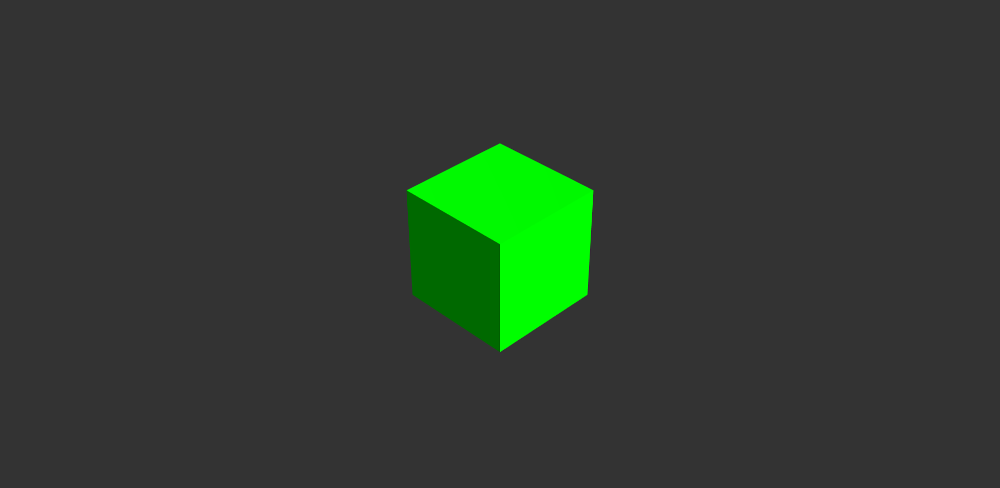

# Getting Started

You can install CUBE.gl with npm and modern front-end project build tools (eg. Webpack) or just simply importing an .JS file locally or remotely. For most of the developer, npm is the best choice.

## Installation


### Import by CDN

Simply add this line in your .HTML file.

```html
<script src="https://unpkg.com/cube.gl@latest/dist/cube.js"></script>
```


### Install from NPM

By importing the project from NPM module system, you need to install node.js. Open a terminal, direct to your project folder, execute following command:


`npm i cube.gl`


Remember you need to use a build tool like webpack if you building a modern JavaScript front-end project. For more detail you can try learn more by search React.js or Vue.js on internet.


## Hello World


### Create first scene


1. Create a div block with id in HTML:

```html
<div id="container" style="position: absolute; width: 100%; height: 100%;"></div>
```


2. Write following code

```javascript
// Get target container
const container = document.getElementById('container')

// Init CUBE instance
const C = new CUBE.Space(container, {
	background: "333333", // Set Background Color
	center: {latitude: 34.710554, longitude: 103.699520}, // Set a geo location center
	scale: .002, // Set a map scale
	camera:{
		position: {x: 5, y: 5, z: 5} // Set camera default position
	}
})

// Add a basic box with wgs84 coordinate
const posi = new CUBE.Coordinate("GPS", {latitude: 34.710554, longitude: 103.699520}).ComputeWorldCoordinate()
const box = C.Add(new CUBE.Shapes("Box", posi.world).Box(1))
box.position.y = 1

// Animate scene every frame
Update()
function Update(){
    requestAnimationFrame(Update)
    C.Runtime()
}
```

*The scale is set to 0.002 because we are going to load a administrative map for an whole country in the next step, set it to 5-10 if you want to visualize in city / street level.*


Run your project, you will see a green cube placed in the middle of your screen as the coordinate is equal to the center coordinate.





3. Now let's explore more. Add the following line **before Update()**

```javascript
// Add Geojson Map Layer
const china = 'https://gistcdn.githack.com/isjeffcom/787220f51465c8365b4ccc7247a919e7/raw/1afd3f92f64d8dd01534b6831d65de395f07b43e/china.geojson'
fetch(china).then(async (res)=>{
    C.Add(new CUBE.GeoJsonLayer("china", await res.json()).AdministrativeMap({border: true, height: .5}))
})

// Add an cylinder bar at Shanghai City Center
const shanghai = {latitude: 31.230689, longitude: 121.473723}
const bar = new CUBE.Data("shanghai").Cylinder(shanghai, 150, 40, .5, 0xff6600)
C.Add(bar)
```

*If the .geojson file fail to request, download it from [here](https://gist.github.com/isjeffcom/787220f51465c8365b4ccc7247a919e7) * 


Run your project, you will see an administrative map of China display in the center, with a cylinder bar and... Great. You have finished your first project.


## Use with Threejs

The CUBE.gl is build upon three.js. You can access the built-in three.js by CUBE.Space.three or CUBE.Space.Three(). The current CUBE build is using three.js 0.119. You can also try to implement a different version.


More about three.js you can check [here](https://threejs.org)


## Use with MVVM Framework

The CUBE.gl has no limitation to use in any MVVM framework as long as you can access DOM element to rendering. 


### Use with Vue.js

Here is an example how to use CUBE.gl in Vue.js with Vue-Cli.


```vue
<template>
    <div id="app">
        <div id="cont"></div>
    </div>
</template>

<script>

import * as CUBE from 'cube.gl'

export default {
    name: "app",
    data(){
        return{
            C: null,
            Center: {latitude: 41.157937, longitude: -8.629108}, // Porto
        }
    },
    mounted(){
        this.Init()
        this.Update()
    },
    methods: {
        Init(){
            let container = document.getElementById('cont')

            // Init CUBE Instance
            this.C = new CUBE.Space(container, {
                background: "333333", 
                center: this.Center, 
                scale: 10
            })

            //Add a basic box with wgs84 coordinate
            let posi = new CUBE.Coordinate("GPS", {latitude: 41.157937, longitude: -8.629108}).ComputeWorldCoordinate()
            this.C.Add(new CUBE.Shapes("Box", posi.world).Box(1))

            // Add Sphere
            this.C.Add(new CUBE.Shapes("Sphere", {x: 2, y: 0, z: 2}).Sphere(1, 0x00ffff))
            this.C.Add(new CUBE.Shapes("Cylinder", {x: -2, y: 0, z: -2}).Cylinder(1, 0xff0000))

        },

        Update(){
            requestAnimationFrame(this.Update)
            this.C.Runtime()
        }
    }
}
</script>
```


